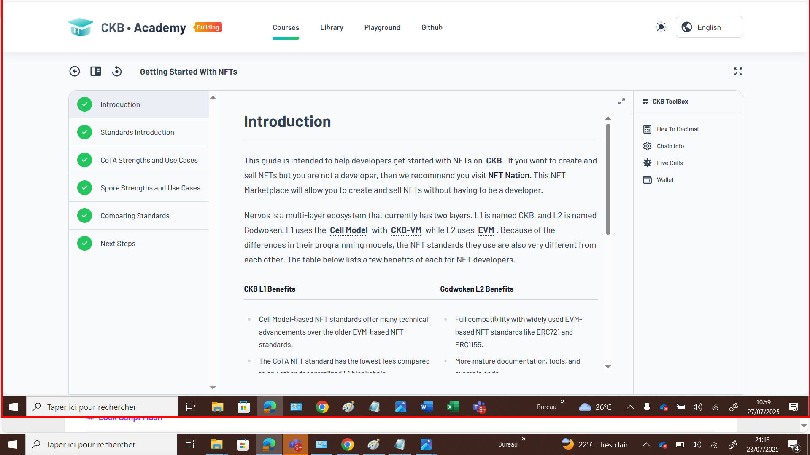

# Week 05 Report – SENNARIA Imane –July 25-27, 2025

## What I Did

I completed the NFT Starter Course module as well as the Dapps with CKB Networks module. 

### NFT Course completion  

### What I Learned

- **Nervos Architecture**  
  - **L1 (CKB)**: Cell Model and CKB-VM  
  - **L2 (Godwoken)**: EVM

- **NFT Standards on CKB L1**  
  - **CoTA**:  
    - Off-chain data with on-chain proof via SMTs
    - A CoTA cell is used to hold the 32-byte proof data
    - Low fees ( $0.01)  
    - Great for Art,Music, gaming. 
  - **Spore**:  
    - Fully on-chain content  
    - High permanence and decentralization  
    - Best for high-value or low-data NFTs

## Challenges I Faced

- Installed **CKB Studio**, only to find out it's **deprecated**, which limited its usefulness for the Dapps module.
