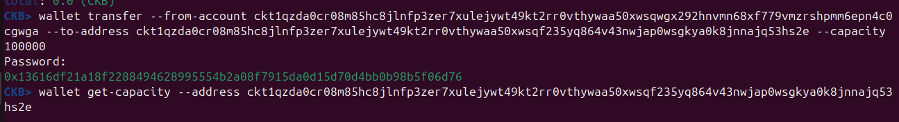
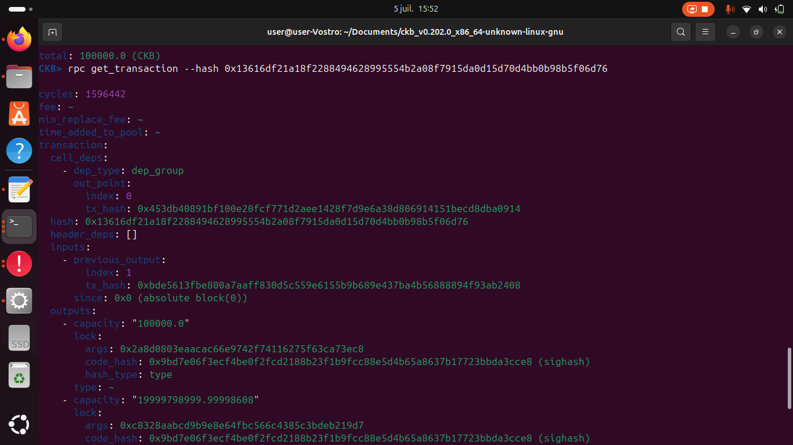
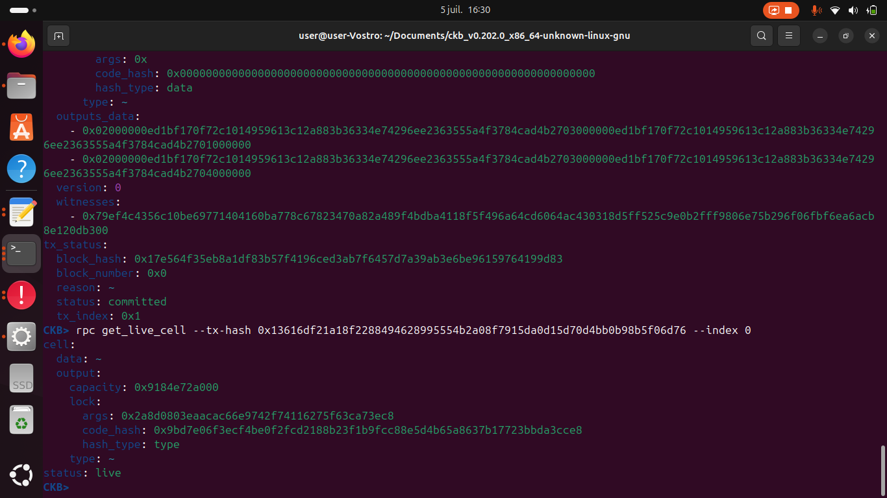
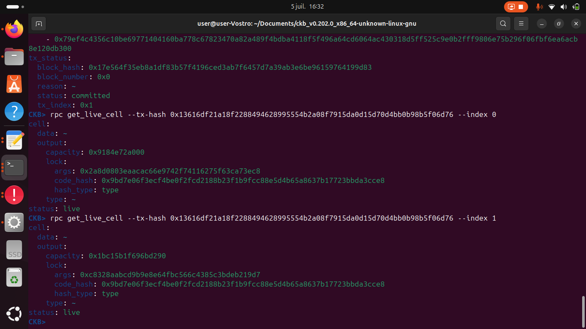
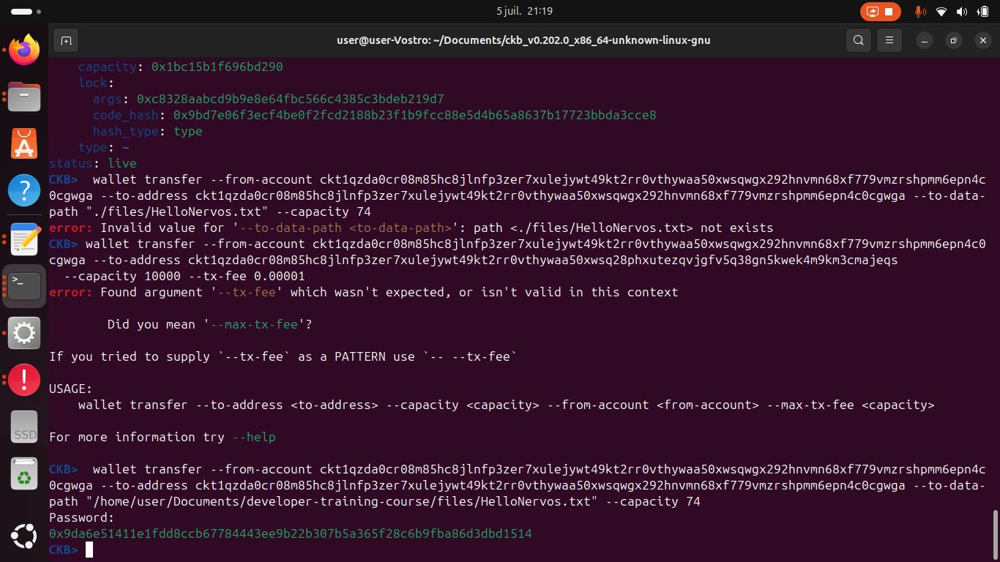

# Week 02 Report – GADDAH Amine – June 30–July 6, 2025

## What I Did

- Installed all necessary tools and dependencies for running the CKB dev chain and working with `ckb-cli`.
- Successfully sent a basic transaction and transferred **100,000 CKBytes**.
- Examined transactions, determined, and validated the out points.
- Continued the course "L1 Developer Kit" up to the **"Introduction to Capsule"** section (I skipped the Lumos programming parts).

### Transferring 100,000 CKBytes Using `wallet transfer`

### Full Transaction Details via `rpc get_transaction`
This output displays a successful transaction with detailed input/output structure, capacity values, lock scripts, and associated hashes.

 

### Confirming Cell Availability with `rpc get_live_cell`
The command confirms that the cell at index 0 of the given transaction is **live**, with a capacity of `0x9184e72a000` and a valid lock script.

### Verifying Multiple Live Cells from a Single Transaction
This shows that both output cells (index 0 and index 1) from the same transaction are **live** and contain distinct capacity values and lock scripts.

###  Transferring 74 CKBytes with Embedded File Data
This command sends 74 CKBytes and attaches `HelloNervos.txt` as part of the transaction using the `--to-data-path` option.

### Verifying File Hash and Live Cell Data with `blake2b` and `ckb-cli`

### Checking Live Cell Status via `rpc get_live_cell`

### Sending a Transaction with File Attachment Using `wallet transfer`

## What I Learned

- The **out point** of a previous output is defined by a combination of the transaction hash and the output index.
- Each **node** on the Nervos network stores a **complete copy of the blockchain**, ensuring transparency and data consistency.
- A **cell's minimum size** is **61 bytes**, which includes mandatory fields such as capacity, lock, and optional data.
- Nervos is a **transaction-oriented blockchain**—we don’t invoke functions or methods like in Ethereum. Instead, we rely on transaction structure and scripting.
- Transactions are validated through **lock scripts** and, optionally, **type scripts**:
  - **Lock scripts** are executed in the **inputs** to verify spending rights.
  - **Type scripts** (optional) are executed on both **inputs and outputs** for additional validation logic.
- The main difference between a **lock script** and a **type script** is their purpose:
  - A **lock script** is used to verify **ownership**—it ensures that only the rightful owner can unlock and spend a cell (similar to a private key check).
  - A **type script** is used to enforce **logic or rules** on how a cell can be used—this is often used in applications like token standards or smart contract validation.
- The **Blake2b** tool is used to generate hashes (e.g., for file data or arguments), which are often required in scripts or transaction construction.
- Much of the logic (script generation, validation setup) happens **off-chain** before the transaction is submitted to the chain.
## Challenges I Faced

- I initially failed to run the miner due to a misconfiguration in the `ckb.toml` file.
- The issue was caused by a **comment left in the `[block_assembler]` section**, which prevented the miner from starting.
- After removing the comment, the miner worked as expected.
- This debugging experience helped me understand that if you want the miner to **pick up and execute a specific transaction**, you often need to **assign it a higher fee**—otherwise, it may remain unprocessed in the pool.

## Gols for Next Week

- Complete the **L1 Developer Training Course**.
- Construct and successfully send my **first custom CKB transaction** from scratch.
