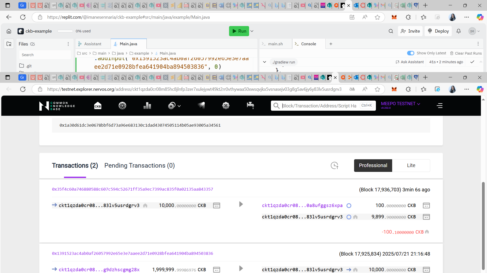

# Week 04 Report – SENNARIA Imane –July 21-22, 2025

## What I Did

-Complete the module: Construct and Send Your First CKB Transaction

### Generate Key Pair Execution Output  

### Create an Address Execution Output  

### Construct a transaction to send 100 CKBytes Execution Output

### Sign a Transaction Execution Output

### Send a Transaction

### Use the output that has already been spent in Input

==> Because the transaction is trying to use an outpoint that has been already spent
### covert one cell to 3 live cells

==> We had to include the transaction fees in our calculations
### Spend multiple outputs in Input

==>We had to group the signatures using fulfill(tx, 0, 1).
### Make the number of CKBytes in the output greater than that in the Input

==>Obvious error: malformed overflow transaction!
## What I Learned

I’ve learned how to create and send a basic transaction using Java.

## Challenges I Faced

- No challenges this week

