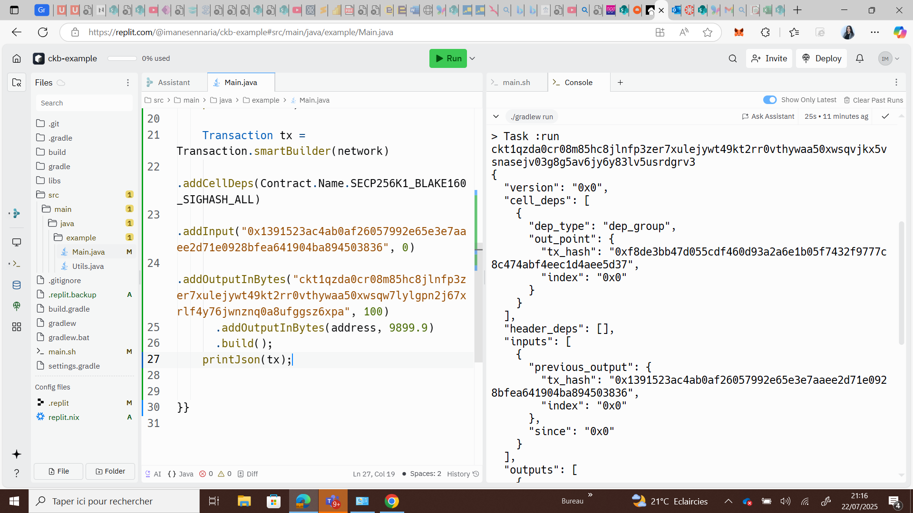

# Week 04 Report – SENNARIA Imane –July 21-22, 2025

## What I Did

-Complete the module: Construct and Send Your First CKB Transaction

### Generate Key Pair Execution Output  

### Create an Address Execution Output  

### Construct a transaction to send 100 CKBytes Execution Output

### Sign a Transaction Execution Output

### Send a Transaction

## What I Learned

- Understood the basic structure of a project.
- Learned about high-level functions and syscalls, and why Rust is often preferred over C in this context.

## Challenges I Faced

- Initially installed the wrong version of Capsule (v0.10 instead of the required v0.9), which caused  issues.
  

## Gols for Next Week

- Completed the Rust programming video series on YouTube.
- Advance further in the Rust course on Amine's Udemy account — aim to reach 50% or more.
- Construct and successfully send my **first custom CKB transaction** from scratch.
