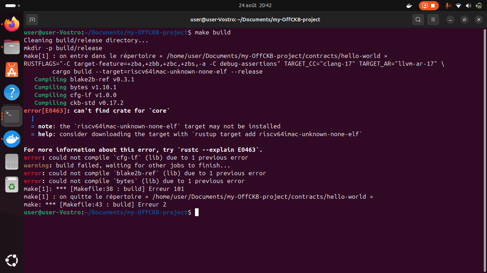

# Week 07 Report – offCKB Project  
**Name:** SENNARIA Imane
**Period:** August 24–28, 2025  


## What I Did
### Running the Devnet Environment
Successfully launched the offCKB devnet environment.


Faced multiple build errors related to missing targets and crates.

-  `can't find crate for 'core'`  
-  `could not compile 'cfg-if'`  
-  Problem was resolved after installing missing Rust target and adjusting environment.

  
  


###  Transfer & Deposit Commands

Successfully :
- Transfer CKB tokens between accounts
- Check balances before and after
- Deposit into devnet accounts

  
  


### Listing Accounts 

Listed available test accounts using `offckb accounts`.


### Checked Devnet Configuration

Ran `offckb config list` to inspect RPC URLs, paths, and environment settings.


## What I Learned

- How to troubleshoot make build issues (`core` crate missing, target not installed)
- How to run and interact with offCKB devnet
- Using the commandes for transfers, balance checks, and deposits
- Exploring the default test accounts and configuration settings


##  Challenges I Faced

### Build Errors
- Encountered issues related to the `riscv64` target not being installed.
- Had to run:  
  ```bash
  rustup target add riscv64imac-unknown-none-elf
