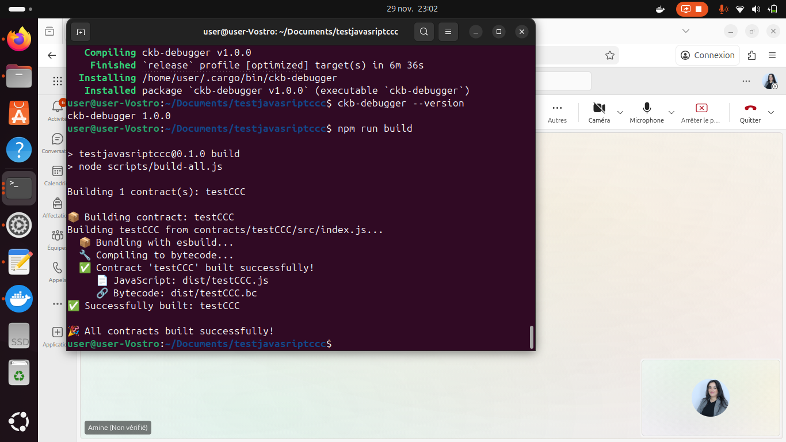
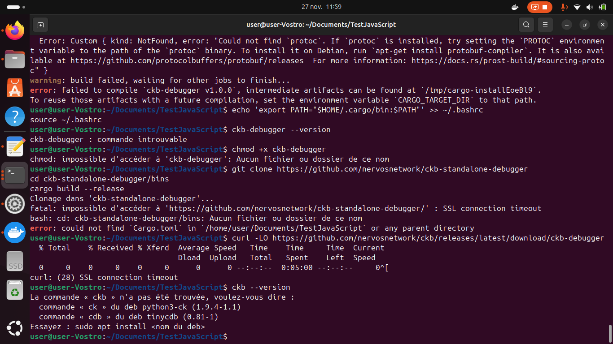
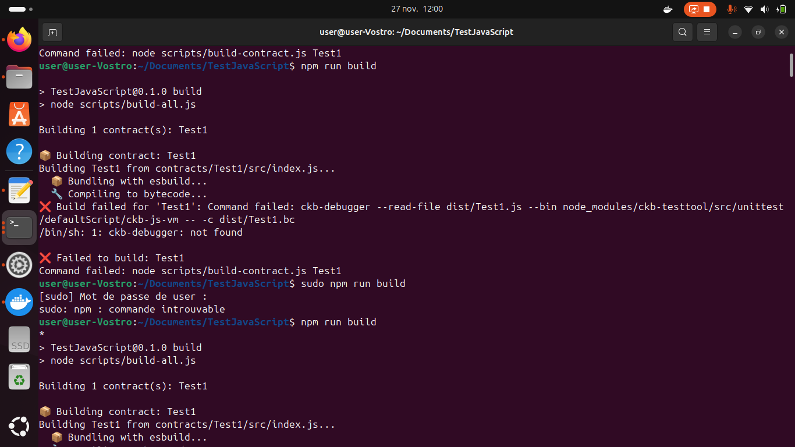
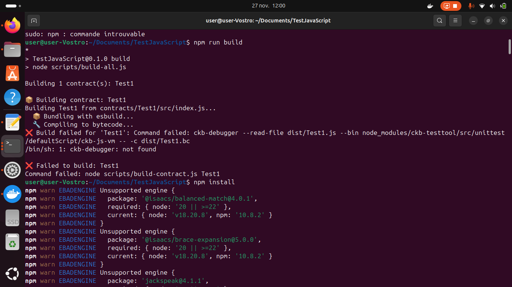
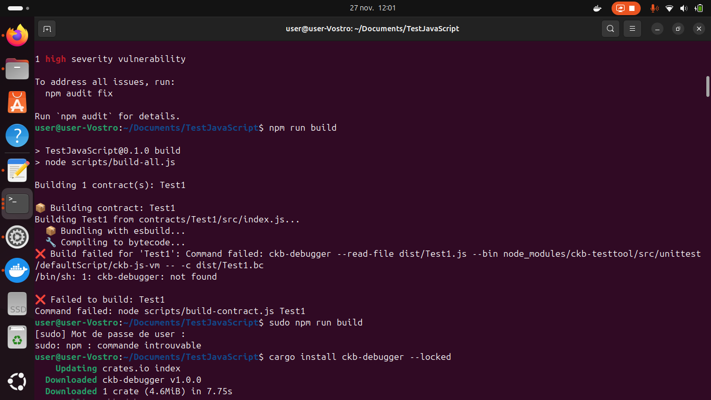

# Week 10 Report – SENNARIA IMANE  
**November 17 – December 1, 2025**

##  What I Did

### 1. Built my JavaScript smart contract (`testCCC`)
I successfully bundled and compiled my TypeScript/JavaScript contract using **esbuild**, generating the `.bc` bytecode file.

---

### 2. Installed and configured all required CKB tools
The installation of **ckb-debugger** was challenging due to missing dependencies (`protoc`) and PATH issues. Multiple errors occurred before the installation succeeded.

  
  
  
  

---

### 3. Attempted to run tests on Devnet – Failed
Running tests on Devnet caused this error because **ckb-js-vm is NOT deployed on Devnet**.

---

### 4. Successfully deployed the contract on Testnet
Since Devnet does not support JS VM, I deployed the smart contract on **Testnet** instead.

**Command used:**

offckb deploy --network testnet --target dist/testCCC.bc

###5. Verified deployment on CKB Explorer (Testnet)
✔ Data section

The data stored in the cell is:

0x6d79

✔ Type Script section

Displays:

code_hash

hash_type

args

###6. Executed tests on Testnet

The test successfully sent a transaction:

TX Hash: 0x3b7720df175b7b2b21336041a7659d23cd0d5f781d9f2d9b483a6e84ef93704e

But Jest displayed an async warning:

Jest did not exit one second after the test run has completed.
Cannot log after tests are done.5. Verified deployment on CKB Explorer (Testnet)
✔ Data section

The data stored in the cell is:

0x6d79

✔ Type Script section

Displays:

    code_hash

    hash_type

    args

###6. Executed tests on Testnet

The test successfully sent a transaction:

TX Hash: 0x3b7720df175b7b2b21336041a7659d23cd0d5f781d9f2d9b483a6e84ef93704e

But Jest displayed an async warning:

Jest did not exit one second after the test run has completed.
Cannot log after tests are done.
Did you forget to wait for something async?

## Challenges I Faced

    Missing protoc

    SSL timeout during installation

    PATH not updated

    ckb-debugger: command not found

    Devnet does not support ckb-js-vm

    Some dependencies required Node 20+

    Async issues in Jest tests

Fix used:

cargo install ckb-debugger --locked

## Results

    Contract built successfully

    ckb-debugger installed

    Successful deployment on Testnet

    Explorer confirmed valid script + data

    Testnet transaction sent successfully

    Identified async test issues

## Goals for Next Week

    Fix async operations in Jest tests

    Add test assertions for reading/writing contract data

    Build a more advanced test scenario

    Begin developing a more complex JavaScript smart contract

Did you forget to wait for something async?

## Challenges I Faced

Missing protoc

SSL timeout during installation

PATH not updated

ckb-debugger: command not found

Devnet does not support ckb-js-vm

Some dependencies required Node 20+

Async issues in Jest tests

Fix used:

cargo install ckb-debugger --locked

## Results

Contract built successfully

ckb-debugger installed

Successful deployment on Testnet

Explorer confirmed valid script + data

Testnet transaction sent successfully

Identified async test issues

## Goals for Next Week

Fix async operations in Jest tests

Add test assertions for reading/writing contract data

Build a more advanced test scenario

Begin developing a more complex JavaScript smart contract5. Verified deployment on CKB Explorer (Testnet)

    Begin developing a more complex JavaScript smart contract

